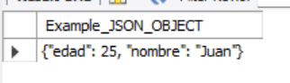

# JSON Functions

# Funciones de JSON en MYSQL

JSON es un formato de intercambio de datos ampliamente utilizado en la web. MYSQL proporciona un conjunto de funciones para manejar JSON. En este blog, exploraremos estas funciones con ejemplos.

## JSON_OBJECT

La función JSON_OBJECT crea un objeto JSON a partir de una lista de pares clave-valor. Por ejemplo:

```sql
SELECT JSON_OBJECT('nombre', 'Juan', 'edad', 25);
```



Esto devuelve un objeto JSON con las claves "nombre" y "edad" y los valores "Juan" y 25, respectivamente.

## JSON_ARRAY

La función JSON_ARRAY crea un array JSON a partir de una lista de valores. Por ejemplo:

```sql
SELECT JSON_ARRAY('Manzana', 'Naranja', 'Plátano');
```


Esto devuelve un arreglo JSON con los valores "Manzana", "Naranja" y "Plátano".

## JSON_EXTRACT

La función JSON_EXTRACT se utiliza para extraer un valor de un objeto JSON. Por ejemplo:

```sql
SELECT JSON_EXTRACT('{"nombre": "Juan", "edad": 25}', '$.nombre');
```


Esto devuelve el valor "Juan" del objeto JSON.

## JSON_MERGE

La función JSON_MERGE se utiliza para combinar dos o más objetos JSON. Por ejemplo:

```sql
SELECT JSON_MERGE('{"nombre": "Juan", "edad": 25}', '{"ciudad": "Bogotá"}');
```


Esto devuelve un objeto JSON que combina los dos objetos JSON proporcionados.

## JSON_SEARCH

La función JSON_SEARCH se utiliza para buscar un valor en un objeto JSON. Por ejemplo:

```sql
SELECT JSON_SEARCH('{"nombre": "Juan", "edad": 25}', 'one', 'Juan');
```


Esto devuelve la ruta del valor "Juan" dentro del objeto JSON.

## JSON_VALID

La función JSON_VALID se utiliza para verificar si una cadena es un objeto JSON válido. Por ejemplo:

```sql
SELECT JSON_VALID('{"nombre": "Juan", "edad": 25}');
```


Esto devuelve un valor booleano que indica si la cadena proporcionada es un objeto JSON válido.

## JSON_UNQUOTE

La función JSON_UNQUOTE en MYSQL se utiliza para eliminar comillas dobles de una cadena JSON. Es útil cuando se necesita extraer un valor de una cadena JSON que está entre comillas dobles. Por ejemplo:

```sql
SELECT JSON_UNQUOTE('"Juan"');
```


Esto devuelve la cadena "Juan" sin las comillas dobles.

## JSON_SET

La función JSON_SET se utiliza para modificar un objeto JSON existente. Toma tres argumentos: el objeto JSON a modificar, la ruta del valor a modificar y el nuevo valor. Por ejemplo:

```sql
SELECT JSON_SET('{"nombre": "Juan", "edad": 25}', '$.edad', 26);
```


Esto devuelve un objeto JSON modificado con la edad actualizada a 26.

## JSON_TYPE

La función JSON_TYPE se utiliza para obtener el tipo de un valor JSON. Por ejemplo:

```sql
SELECT JSON_TYPE('25');
```


Esto devuelve el tipo de valor JSON de la cadena proporcionada, que en este caso es "INTEGER".

```sql
SELECT JSON_TYPE('{"nombre": "Juan", "edad": 25}');
```


Esto devuelve el tipo de valor JSON de la cadena proporcionada, que en este caso es "OBJECT".

La función JSON_MERGE_PRESERVE es similar a la función JSON_MERGE, pero preserva los valores de las claves duplicadas en lugar de sobrescribirlos. Por ejemplo:

```sql
SELECT JSON_MERGE_PRESERVE('{"nombre": "Juan", "edad": 25}', '{"nombre": "María", "ciudad": "Bogotá"}');
```


Esto devuelve un objeto JSON que combina los dos objetos JSON dados, pero preserva el valor "Juan" de la propiedad "nombre" creando un array en esta. Es parecida a JSON_MERGE.

La función JSON_ARRAYAGG se utiliza para agregar valores a un array JSON. Por ejemplo:

```sql
SELECT JSON_ARRAYAGG(name) FROM clientes;
```


Esto devuelve un array JSON con los nombres de todos los clientes en la tabla "clientes".