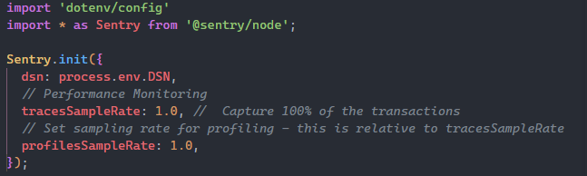
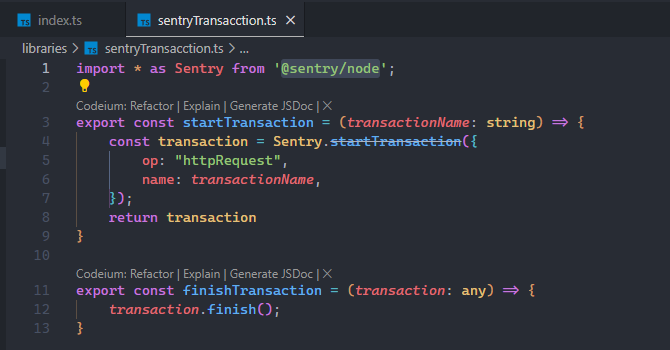
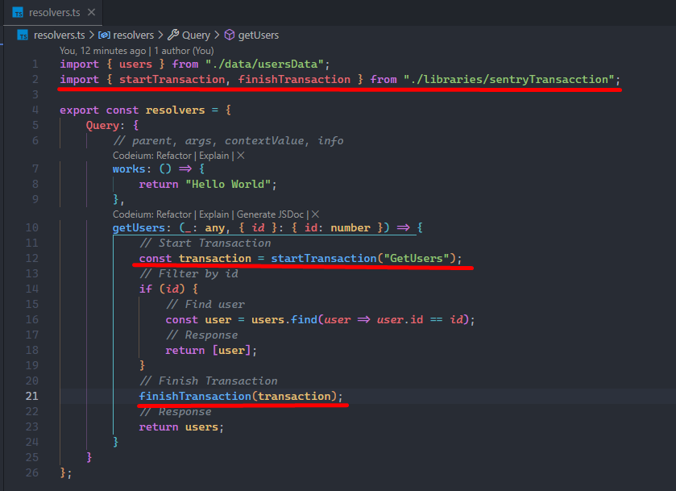
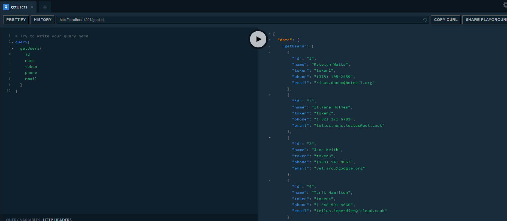
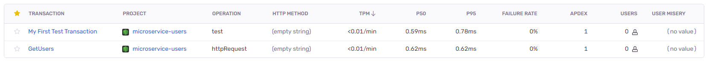
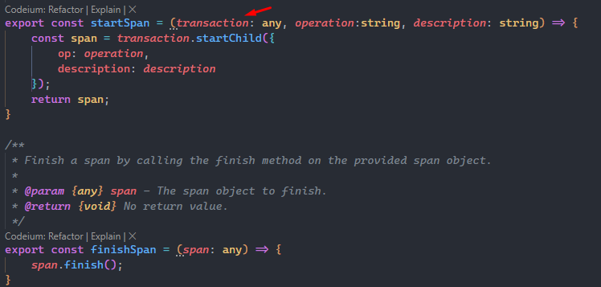
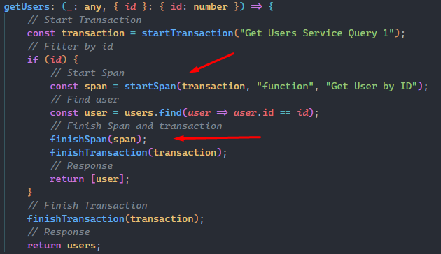
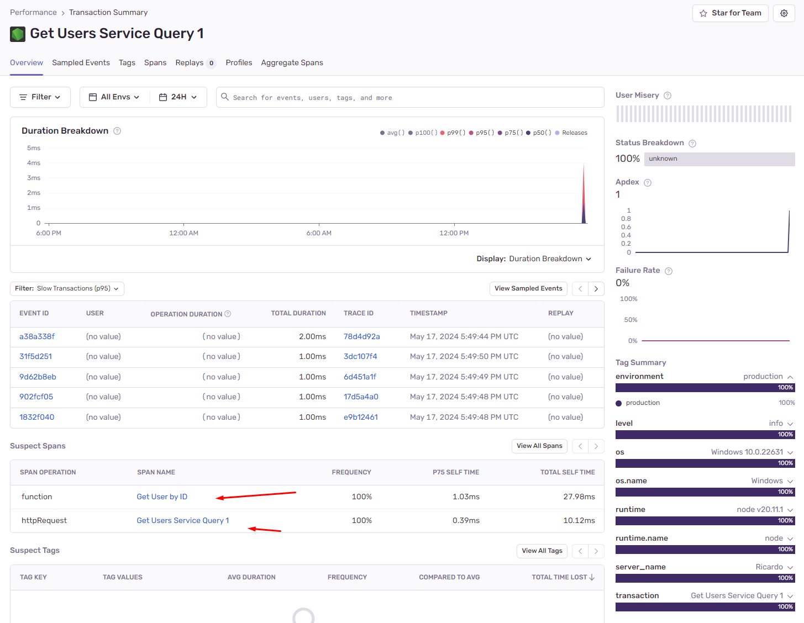

# Implementar Sentry en Microservico GQL

1-. Para implentar Transacctions en un microservicio de manera manual se necesita instalar las siguiente librería:
`@sentry/node`

2-. Realizado lo anterior se tiene que importar en el archivo donde se levanta el servidor.

3-. Para manejar las trasancciones se crear la librería sentryTransacction. Dentro de esta se agregaran dos funciones, una para crear la transacción y otra para finalizarla

4-. Para utilizarla se tiene que importar esta librería creada, en uno de los resolver se creo una transacción `startTransaction("GetUsers")`, la cual se guardo en una constante con el fin de poder utilizar esta para finalizar esta.

Al ejecutar la Query de GetUsers se debe registrar una transacción en el dashborad de sentry.

Tal como se predijo, esta fue registrada

Para agregar spans se crearon los siguientes dos métodos, el primero recibe el transaction,  el segundo el nombre de la operación y el tercero la descripción de este.

Para utilizarlo se le tiene que pasar el objeto de transacction.

Si ejecutamos el query para obtener un usuario por ID y checamos en dashboard de sentry se puede ver que ambos registros se han agregado.

