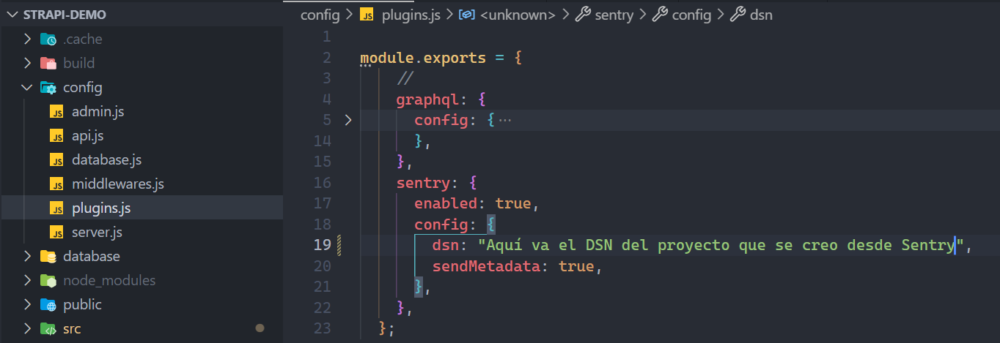
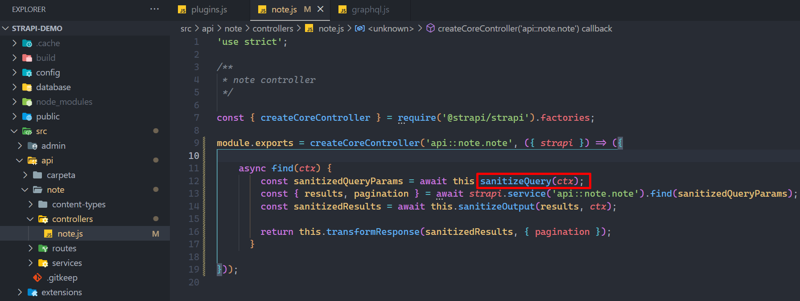
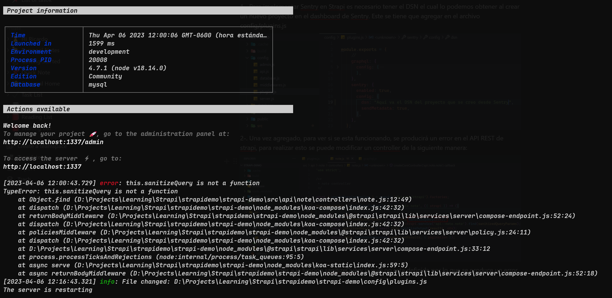
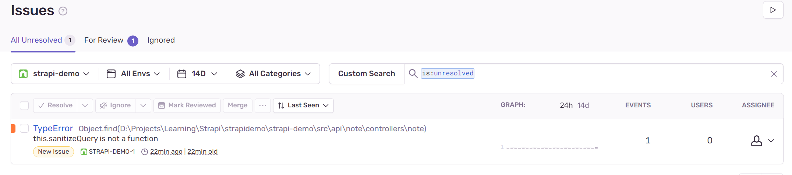

# Implement Sentry With Strapi

## Create Project in Dashboard Sentry

1-. Seleccionar en que tecnología esta realizado el proyecto al que se agregar Sentry, en este caso Strapi esta realizado en node js.

2-. Se seleccionan con que frecuenta se quiere recibir alertas, se da un nombre y se da clic en crear.

3-. Ahora ya se tiene DSN para poder agregarlo al proyecto de Strapi.

## Implement in Code

1-. Para implementar Sentry en Strapi es necesario tener el DSN el cual lo podemos obtener al crear un nuevo proyecto en el dashboard de Sentry. Este se tiene que agregar en el archivo config/plugins.js 

2-. Una vez agregado, para ver si se esta funcionando, se producirá un error en el API REST de strapi, para realizar esto se puede modificar un controller de la siguiente manera: 

En esta llamamos a la función sanitizeQuery la cual no esta definida por lo que al ejecutar el request   find del controller note se produce un error

Como se puede observar este fue registrado en Sentry

