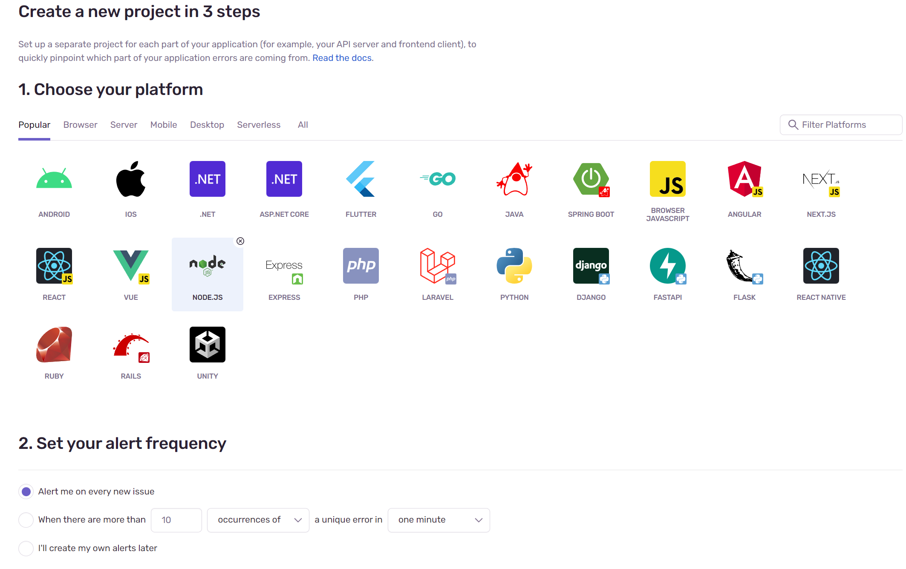

# Implement Sentry With Strapi

## Create Project in Dashboard Sentry

1-. Seleccionar en que tecnología esta realizado el proyecto al que se agregar Sentry, en este caso Strapi esta realizado en node js.

2-. Se seleccionan con que frecuenta se quiere recibir alertas, se da un nombre y se da clic en crear.

3-. Ahora ya se tiene DSN para poder agregarlo al proyecto de Strapi.

